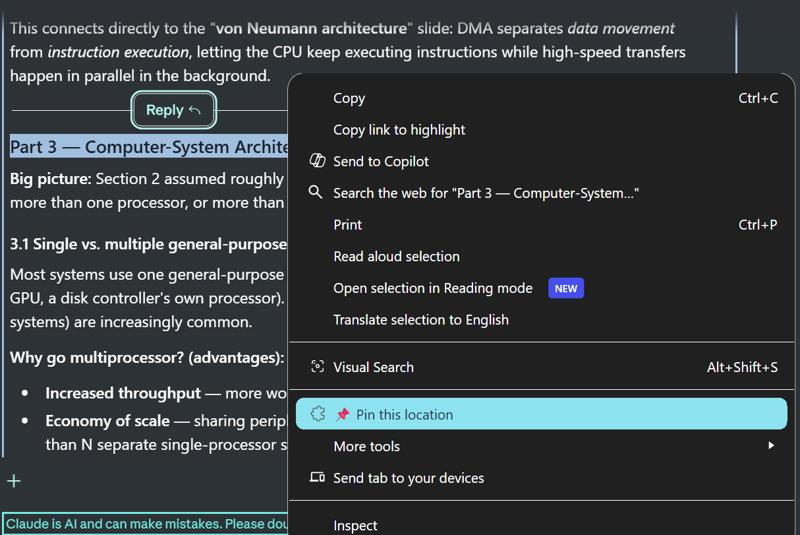
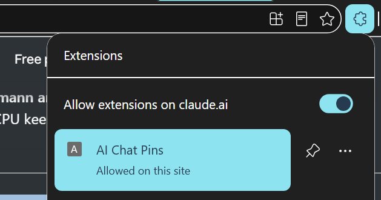
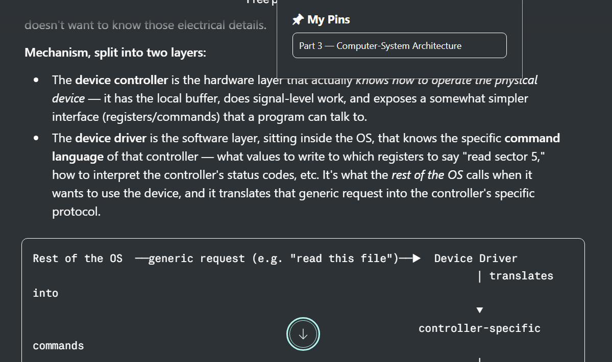

# AI Chat Pins

A Chrome extension that lets you "pin" your exact reading position inside long ChatGPT and Claude conversations — and jump back to it later, even after the conversation has grown much longer.

## The problem

AI chat responses can get extremely long. Traditional bookmarks that save a scroll position break the moment the page layout changes — which happens constantly in ChatGPT/Claude as new messages are added.

## The solution

Instead of saving *where* you were (a coordinate), this extension saves *what* you were reading (the text itself, plus surrounding context). When you click a pin, it searches the live page for that content and scrolls to it — automatically scrolling through the conversation if needed, since both ChatGPT and Claude virtualize long conversations (older messages get removed from the DOM until you scroll back near them).

## How it works

1. Select any text inside an AI response.
2. Right-click → **📌 Pin this location**.
3. Open the extension popup anytime and click a saved pin.
4. The page scrolls to the matching content and briefly highlights it.

## Installation (not yet on the Chrome Web Store)

1. Download or clone this repository.
2. Open `chrome://extensions` in Chrome.
3. Enable **Developer mode** (top-right toggle).
4. Click **Load unpacked** and select the project folder.
5. Open ChatGPT or Claude and start pinning.

## Architecture

- No backend, no account, no database — everything is stored locally via the Chrome `Storage API`.
- `content-scripts/core.js` — the anchoring engine (site-agnostic).
- `content-scripts/adapters/` — small site-specific modules (ChatGPT, Claude) that tell the core engine how to find message containers on each site.
- `background.js` — registers the right-click context menu.
- `popup/` — the UI listing saved pins for the current conversation.

## Status

This is a personal learning project — my first solo project on GitHub.

## License

MIT License © 2026 Noura Wael